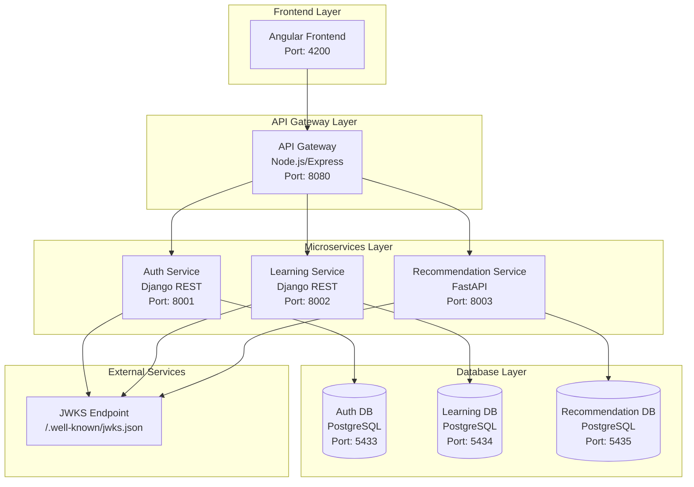
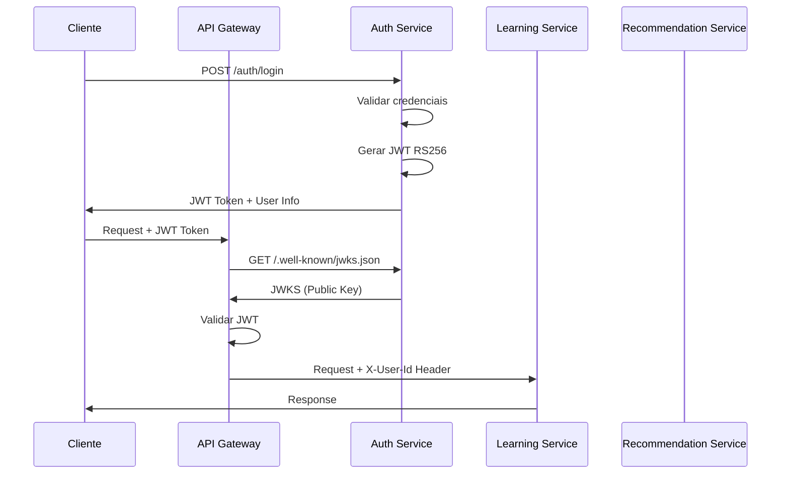
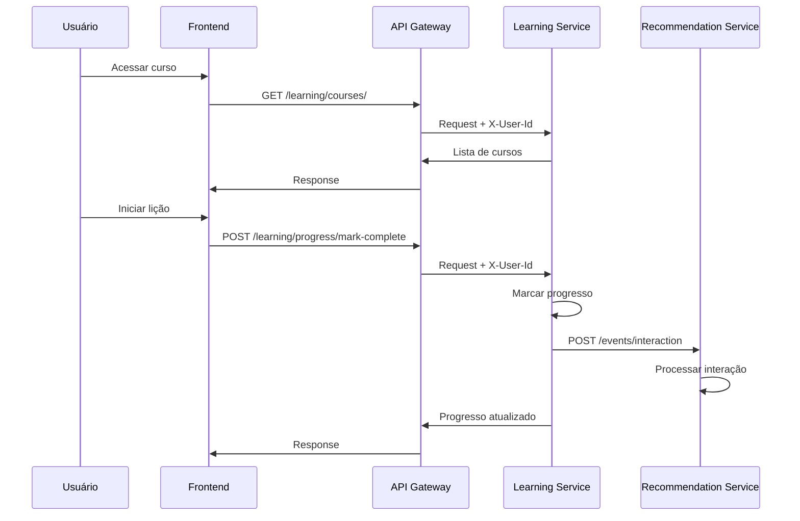
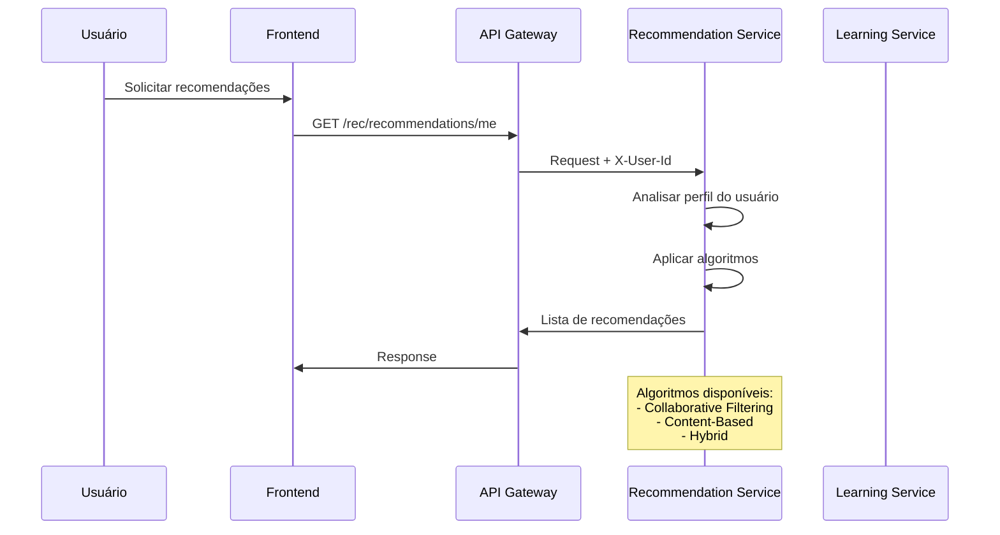
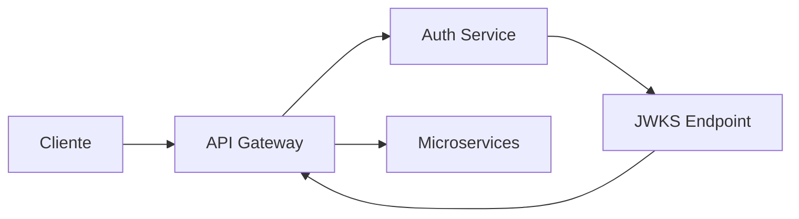
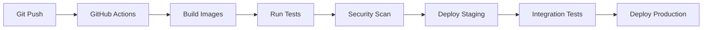

# 🏗️ Arquitetura do AVA

Este documento descreve a arquitetura completa do AVA (Adaptive Virtual Assistant), incluindo diagramas, fluxos de dados e decisões arquiteturais.

## 📊 Visão Geral da Arquitetura

### Diagrama de Alto Nível

## 🔄 Fluxos Principais

### 1. Fluxo de Autenticação

### 2. Fluxo de Aprendizado

### 3. Fluxo de Recomendações

## 🏛️ Padrões Arquiteturais

### 1. Microservices

**Benefícios:**
- Escalabilidade independente
- Tecnologias heterogêneas
- Deploy independente
- Falhas isoladas

**Desafios:**
- Complexidade de rede
- Consistência de dados
- Monitoramento distribuído

### 2. API Gateway

**Responsabilidades:**
- Roteamento de requisições
- Validação JWT
- Rate limiting
- CORS
- Logging centralizado

### 3. Database per Service

**Cada serviço possui seu próprio banco:**
- **Auth Service**: Usuários, tokens, sessões
- **Learning Service**: Cursos, progresso, matrículas
- **Recommendation Service**: Interações, modelos ML

### 4. Event-Driven Architecture

**Eventos principais:**
- `user.login` - Usuário fez login
- `lesson.completed` - Lição concluída
- `course.enrolled` - Usuário se matriculou
- `interaction.created` - Nova interação

## 🔐 Segurança

### 1. Autenticação JWT RS256

**Características:**
- Chaves assimétricas (RSA 2048-bit)
- JWKS público para validação
- Tokens com expiração
- Refresh tokens

### 2. Headers Confiáveis

**Para comunicação interna:**
- `X-User-Id`: ID do usuário
- `X-User-Email`: Email do usuário
- `X-User-Username`: Nome de usuário
- `X-User-Roles`: Roles do usuário

### 3. Rate Limiting

**Limites configurados:**
- Anônimos: 100 req/hora
- Autenticados: 1000 req/hora
- Por IP: 100 req/15min

## 📊 Monitoramento e Observabilidade

### 1. Logging Estruturado

**Formato JSON com:**
- Timestamp ISO 8601
- Correlation ID
- Service name
- User ID
- Request/Response data
- Performance metrics

### 2. Health Checks

**Endpoints de saúde:**
- `/healthz` - Status do serviço
- `/health` - Informações detalhadas
- Health checks no Docker Compose

### 3. Métricas

**Métricas coletadas:**
- Response time
- Request count
- Error rate
- User activity
- Learning progress

## 🚀 Escalabilidade

### 1. Horizontal Scaling

**Estratégias:**
- Load balancer no API Gateway
- Múltiplas instâncias de serviços
- Database sharding (futuro)
- Cache distribuído (Redis)

### 2. Performance

**Otimizações:**
- Connection pooling
- Query optimization
- Caching strategies
- CDN para assets estáticos

## 🔄 CI/CD Pipeline

## 📈 Roadmap Técnico

### Fase 1 - MVP ✅
- [x] Microservices básicos
- [x] Autenticação JWT
- [x] API Gateway
- [x] Frontend Angular

### Fase 2 - Melhorias 🚧
- [ ] Cache Redis
- [ ] Message Queue (RabbitMQ)
- [ ] Monitoring (Prometheus/Grafana)
- [ ] Logging centralizado (ELK)

### Fase 3 - Avançado 📋
- [ ] Machine Learning pipeline
- [ ] Real-time notifications
- [ ] Mobile app
- [ ] Analytics dashboard

## 🛠️ Tecnologias

### Backend
- **Django REST Framework**: APIs robustas
- **FastAPI**: Performance e async
- **PostgreSQL**: Banco relacional
- **Node.js**: API Gateway

### Frontend
- **Angular**: Framework SPA
- **Angular Material**: UI components
- **RxJS**: Reactive programming

### DevOps
- **Docker**: Containerização
- **Docker Compose**: Orquestração local
- **Make**: Automação de tarefas
- **GitHub Actions**: CI/CD

### Monitoramento
- **Structured Logging**: JSON logs
- **Health Checks**: Service monitoring
- **Correlation IDs**: Request tracing

## 📚 Referências

- [Microservices Patterns](https://microservices.io/)
- [JWT Best Practices](https://tools.ietf.org/html/rfc7519)
- [Django REST Framework](https://www.django-rest-framework.org/)
- [FastAPI Documentation](https://fastapi.tiangolo.com/)
- [Angular Documentation](https://angular.io/docs)
